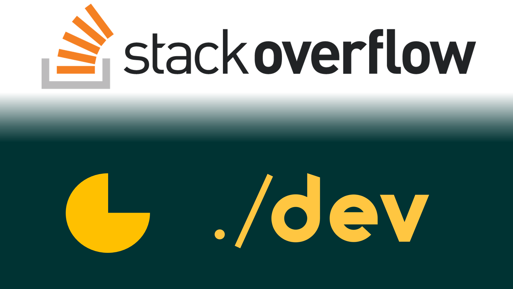

# Stackoverflow

<!---
<figure>
     
</figure>
--->

![alt text][#logo]

[#logo]: ./docs/images/stackoverflow-repo_logo.png

This repository contains my stackoverflow contributions. The repo is under continual construction. I have answered close to 250 questions so far, and I keep updating this repo from time to time. But since I started this repo long after I started answering on Stackoverflow, I have a lot of catching up to do! :smiley:

The answers are maintained in folder [`'./src/answers'`](./src/answers).

My [Stackoverflow profile][#stackoverflow-profile].

[#stackoverflow-profile]: https://stackoverflow.com/users/8474894/cypherx?tab=profile

---
<!---

&nbsp; &nbsp;

--->

[#REPO]: https://github.com/sugatoray/stackoverflow
[#REPO-LICENSE]: https://github.com/sugatoray/stackoverflow/blob/master/LICENSE

&nbsp; &nbsp;
[][#REPO-LICENSE]
&nbsp; &nbsp;
[][#REPO]
&nbsp; &nbsp;
[][#REPO]
&nbsp; &nbsp;

<!---
The REPO stats on number of files, lines of code, etc are generated with: https://github.com/XAMPPRocky/tokei
--->

[][#REPO]
&nbsp; &nbsp;
[][#REPO]
&nbsp; &nbsp;
[][#REPO]
&nbsp; &nbsp;
[][#REPO]
&nbsp; &nbsp;
[][#REPO]
