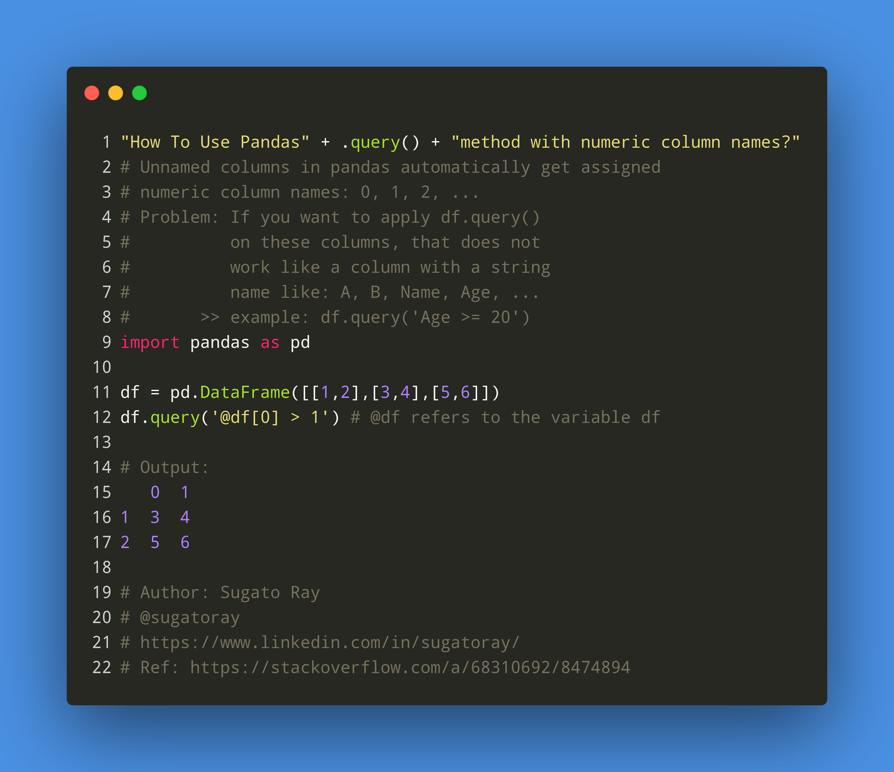

# Question 68310615

**Description: [_How do I refer to an unnamed columns in query string in Pandas?_][#Q]**

[Source][#Q]

[#Q]: https://stackoverflow.com/questions/68310615/how-do-i-refer-to-an-unnamed-columns-in-query-string-in-pandas/68310692#68310692

## Keywords

```bash
# comma separated list of keywords
python, pandas, dataframe
```

---

## Illustration :zap:

[](https://carbon.now.sh/iJzCZ8oWXgIrdbCVkCrg)

---

# Solution

> **Summary**: Best options are given below. See further down for all other options.
>
> - `df.query('@df[1] > 0.5')`
> - `df[df[1] > 0.5]`

Unnammed columns in pandas are automatically named as `0, 1, 2, ...`, where these are numbers and not strings.

The following shows you mainly three ways to achieve what you are looking for.

- Option-1: Avoid renaming columns.
  - Option-1.1: using `df.query('@df[1] > 0.5')`. Here we use `@df` to specify that `df` is a variable.
  - Option-1.2: Here we use the other option `df[df[1] > 0.5]`.
 
- Option-2.x: Rename columns of the dataframe `df` by providing a `dict`: `{0: 'A', 1: 'B', 2: 'C'}`. 
  - You can use `df.query()` in this case.

- Option-3: Rename the columns of `df` using a dict-comprehension as `C#`, where `#` stands for the column number.
  - You can use `df.query()` in this case.

```python
## Option-1: without renaming
#  Option-1.1: with query
df.query('@df[1] > 0.5')
#  Option-1.2: without using query
df[df[1] > 0.5]

## Option-2: rename columns (using a mapping provided manually)
#            columns = {0: 'A', 1: 'B', 2: 'C'}
df = pd.DataFrame(arr).rename(columns={0: 'A', 1: 'B', 2: 'C'})

#  Option-2.1
df[df['B'] > 0.5]

#  Option-2.2
df[df.B > 0.5]

#  Option-2.2
df.query('B > 0.5')

## Option-3: rename dynamically
df = pd.DataFrame(arr)
df = df.rename(columns=dict((x, 'C'+str(x)) for x in df.columns))
df.query('C1 > 0.5')
```

Output:

```sh
          0         1         2
3  0.413839  0.889178  0.564845
5  0.802746  0.941901  0.564068
6  0.904837  0.716764  0.151075
8  0.788026  0.749503  0.960260
```

## Dummy Data

```python
import pandas as pd
import numpy as np

arr = np.random.rand(10, 3)
df = pd.DataFrame(arr)
```

## References

- [Docs: `pandas.DataFrame.query`](https://pandas.pydata.org/pandas-docs/stable/reference/api/pandas.DataFrame.query.html)

- [Stackoverflow: *How to query a numerical column name in pandas?*](https://stackoverflow.com/questions/48089786/how-to-query-a-numerical-column-name-in-pandas)

- [Older Pandas Docs: `multiindex-query-syntax` v-13.0](https://pandas.pydata.org/pandas-docs/version/0.13.0/indexing.html#multiindex-query-syntax)

---
